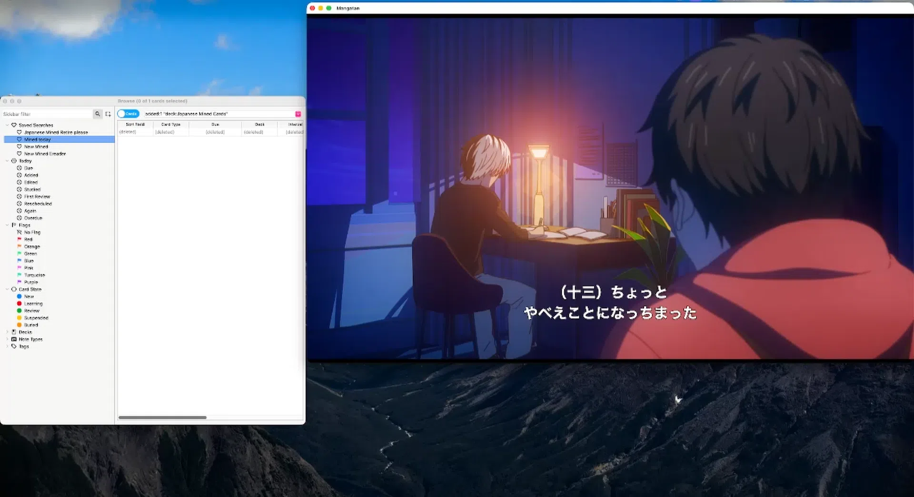
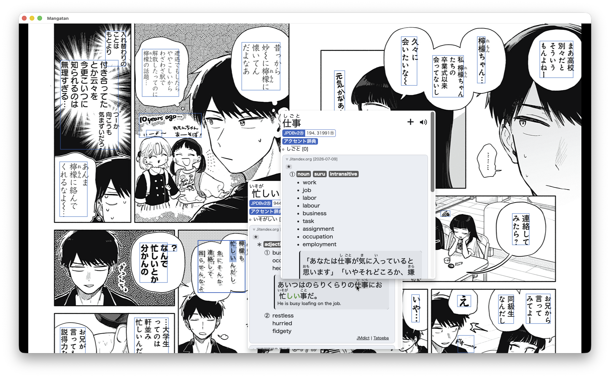
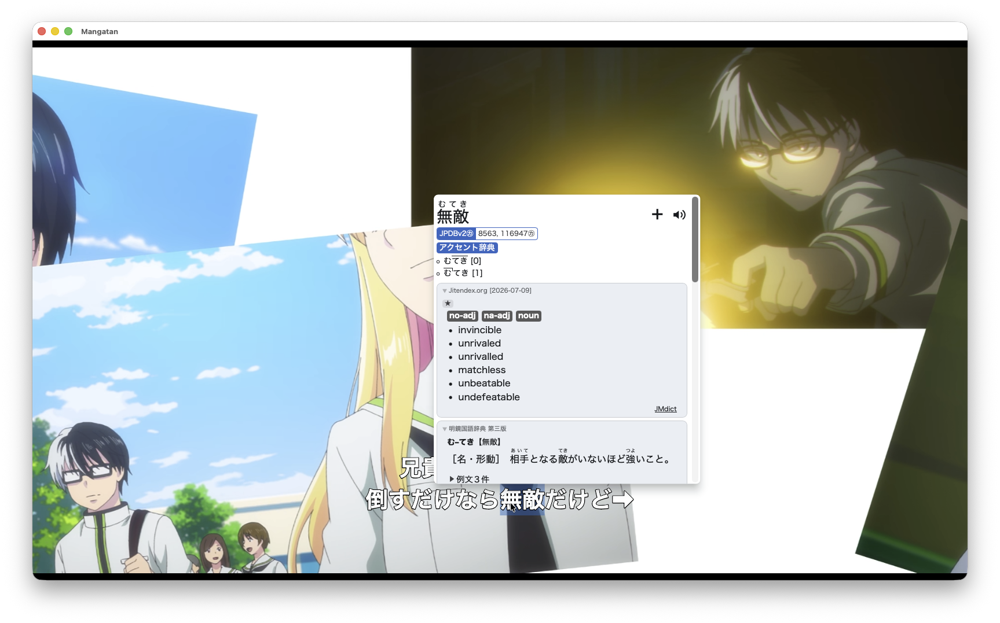
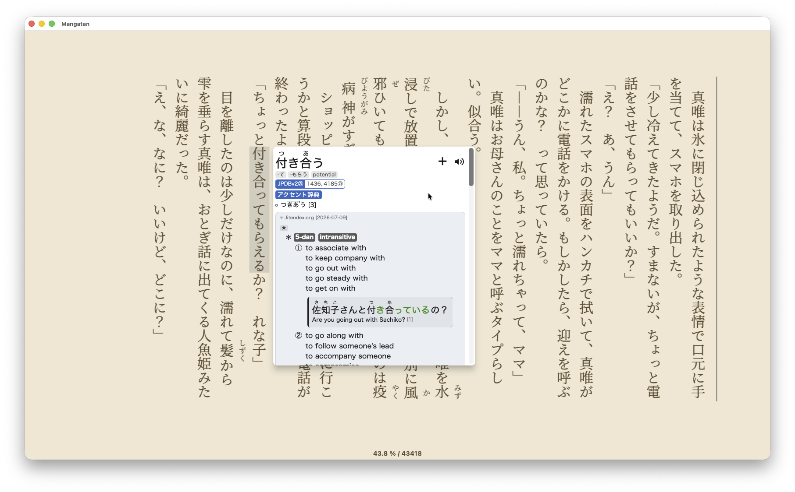
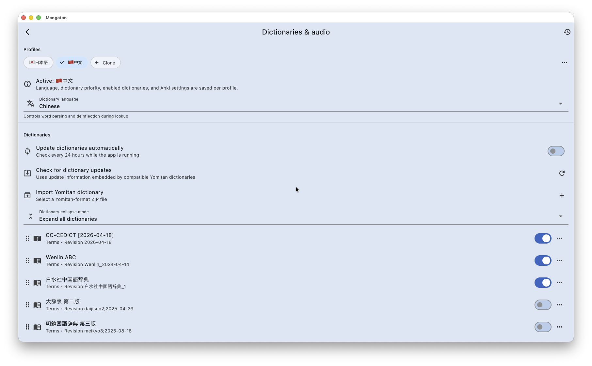

<p align="center">
 
</p>

<h1 align="center">Mangatan</h1>

<p align="center">
  <strong>Turn the manga, novels, and anime you enjoy into language-learning material.</strong>
</p>

<p align="center">
  
</p>

<p align="center"><sub>Look up a line, capture its context, and send it to Anki without leaving the story.</sub></p>

<div align="center">

[](https://github.com/1Selxo/Mangatan/releases/latest)
[](https://github.com/1Selxo/Mangatan/releases)
[](https://github.com/1Selxo/Mangatan/stargazers)
[](LICENSE)
[](https://discord.gg/SqwE6b7Bb)

[Download](https://github.com/1Selxo/Mangatan/releases/latest) · [See the learning tools](#learn-in-context) · [Browse every screenshot](https://github.com/1Selxo/Mangatan/tree/main/media/screenshots) · [Read the changelog](CHANGELOG.md)

</div>

Mangatan is a free, open-source immersion reader for macOS, Windows, and Linux. It brings your media library, OCR, dictionary lookup, and flashcard creation into one desktop app, so an unfamiliar word can become a useful Anki card while its scene is still fresh.

Mangatan aims to bring [Chimahon](https://github.com/sohilsayed/chimahon)—its main inspiration and compatibility target—to macOS, Windows, and Linux, preserving compatibility wherever practical.

Open manga, webtoons, EPUB novels, or video; select text or scan it from the page or frame; explore results from your own Yomitan-format dictionaries; then mine the sentence with its screenshot and audio.

## Download

| Platform | Package |
| --- | --- |
| **macOS** | [Apple silicon DMG](https://github.com/1Selxo/Mangatan/releases/latest) |
| **Windows** | [x64 installer or portable ZIP](https://github.com/1Selxo/Mangatan/releases/latest) |
| **Linux** | [x86-64 archive](https://github.com/1Selxo/Mangatan/releases/latest) or [`mangatan-bin` on the AUR](https://aur.archlinux.org/packages/mangatan-bin) |

Release assets and their SHA-256 checksums are published on the [releases page](https://github.com/1Selxo/Mangatan/releases). The macOS build targets Apple silicon only.

## iOS Sideloading Sources

<a href="https://intradeus.github.io/http-protocol-redirector?r=altstore://source?url=https://raw.githubusercontent.com/1Selxo/Mangatan/refs/heads/main/repo/source.json"></a>
&nbsp;
<a href="https://intradeus.github.io/http-protocol-redirector?r=feather://source/https://raw.githubusercontent.com/1Selxo/Mangatan/refs/heads/main/repo/source.json"></a>
&nbsp;
<a href="https://intradeus.github.io/http-protocol-redirector?r=sidestore://source?url=https://raw.githubusercontent.com/1Selxo/Mangatan/refs/heads/main/repo/source.json"></a>
&nbsp;
<a href="https://raw.githubusercontent.com/1Selxo/Mangatan/refs/heads/main/repo/source.json"></a>

Release IPAs are intentionally unsigned. AltStore, SideStore, Feather, Sideloadly, and similar tools sign the app with your Apple ID during installation.

To build an IPA without publishing a release, open **Actions → Build iOS sideload IPA → Run workflow**. Download the IPA from the completed run's artifacts. Pushing a `v*` tag also attaches the IPA to that GitHub release and refreshes the sideloading source.

## From scene to flashcard

1. **Open something worth reading or watching.** Use local files or add compatible content extensions.
2. **Choose the text.** Select novel text, click a subtitle, or run OCR over a manga page or video frame.
3. **Understand it in place.** Browse deinflected entries, examples, frequency data, and audio from the dictionary popup.
4. **Keep the moment.** Send the sentence, image, and audio to your chosen Anki note type and deck.

## Mangatan in practice

<table>
  <tr>
    <td width="50%" valign="top">
      <a href="media/screenshots/manga-ocr-dictionary.png"></a>
      <br><strong>Read inside the artwork</strong><br>
      <sub>Detect text across a manga page, choose a word, and keep several dictionaries within reach.</sub>
    </td>
    <td width="50%" valign="top">
      <a href="media/screenshots/anime-dictionary-lookup.png"></a>
      <br><strong>Pause, look up, continue</strong><br>
      <sub>Open a definition from subtitles or OCR while the current frame stays visible.</sub>
    </td>
  </tr>
  <tr>
    <td width="50%" valign="top">
      <a href="media/screenshots/novel-dictionary-lookup.png"></a>
      <br><strong>Keep novels flowing</strong><br>
      <sub>Look up words directly in EPUB text, including vertical Japanese layouts.</sub>
    </td>
    <td width="50%" valign="top">
      <a href="media/screenshots/dictionary-profiles.png"></a>
      <br><strong>Make the dictionary yours</strong><br>
      <sub>Build language profiles, order sources, and control which dictionaries appear for each title.</sub>
    </td>
  </tr>
</table>

[Open the full screenshot gallery on GitHub →](https://github.com/1Selxo/Mangatan/tree/main/media/screenshots)

## Learn in context

- **Yomitan-style lookup:** import compatible dictionary ZIPs, arrange their priority, update supported dictionaries, and create separate profiles for the languages and media you use.
- **OCR where text is part of the image:** scan manga pages, tall webtoons, and video frames with selectable OCR engines; cache results or pre-scan chapters for smoother reading.
- **Dictionary tools across the app:** use popup, recursive, subtitle, reader, and manual search flows with shared lookup history, pronunciation audio, and frequency information.
- **Anki mining with the scene attached:** map fields to your preferred note type and export sentences with screenshots and trimmed audio through AnkiConnect.
- **Reading and playback controls built for immersion:** use configurable readers, vertical EPUB layouts, subtitle timing controls, alternate audio tracks, keyboard navigation, and an E-Ink display mode.

## One library for reading and watching

- Organize manga, webtoons, comics, novels, anime, movies, and local media with categories, history, and offline downloads.
- Add compatible Mangayomi, LNReader, and Mihon sources alongside local archives and EPUB files.
- Track manga and anime with [AniList](https://anilist.co/), [MyAnimeList](https://myanimelist.net/), [Kitsu](https://kitsu.io/), [SIMKL](https://simkl.com/), and [Trakt](https://trakt.tv/).
- Back up locally or exchange Chimahon-compatible library data through Google Drive and WebDAV.
- Switch between light and dark themes and tune reader layouts, directions, tap zones, and typography.

> [!NOTE]
> Dictionaries and content are not bundled. Import dictionaries you are licensed to use, and connect Mangatan only to local files or content sources you are authorized to access.

## Getting started

1. Install the latest package for your platform from [GitHub Releases](https://github.com/1Selxo/Mangatan/releases/latest).
2. Open **Settings → Dictionary & audio**, create or select a language profile, and import one or more Yomitan-format dictionaries.
3. To mine cards, start Anki with [AnkiConnect](https://ankiweb.net/shared/info/2055492159) enabled, then choose your deck, note type, and field mapping in Mangatan's Anki settings.
4. Add local media or install a compatible extension, open a title, and start looking up words.

## Build from source

Mangatan uses Flutter and Rust. The release workflow currently builds with Flutter 3.44.4; install a compatible [Flutter SDK](https://docs.flutter.dev/get-started/install), the [Rust toolchain](https://www.rust-lang.org/tools/install), and the Flutter desktop dependencies for your operating system.

```bash
git clone --recurse-submodules https://github.com/1Selxo/Mangatan.git
cd Mangatan
flutter pub get
cargo install flutter_rust_bridge_codegen
flutter_rust_bridge_codegen generate
flutter devices
flutter run -d macos
```

Replace `macos` with `windows` or `linux` when building on those platforms.

On macOS, the project helper builds the desktop app and opens it:

```bash
./scripts/build_macos.sh
```

Pass `--release` for a release build. Run `./scripts/build_macos.sh --help` for the remaining options.

## Project lineage

Mangatan uses [Mangayomi](https://github.com/kodjodevf/mangayomi) as its cross-platform application base, but [Chimahon](https://github.com/sohilsayed/chimahon) is its north star: the goal is to bring Chimahon's immersion-reading workflow and ecosystem compatibility to platforms beyond Android. Features are adapted from Chimahon whenever practical and integrated without discarding Mangayomi's desktop conventions.

[Hoshi Reader](https://github.com/Manhhao/Hoshi-Reader), [Hoshi Reader for Android](https://github.com/HuangAntimony/Hoshi-Reader-Android), and [Yomitan](https://github.com/yomidevs/yomitan) provide further inspiration, with native dictionary support built around [HoshiDicts](https://github.com/Manhhao/hoshidicts).

Please respect the licenses of Mangatan, its upstream projects, extensions, dictionaries, and the media you use with it.

## Contributing

Bug reports and focused pull requests are welcome. Use the [issue tracker](https://github.com/1Selxo/Mangatan/issues) for defects and feature discussions. Extension authors can refer to Mangayomi's archived [Dart extension guide](https://github.com/kodjodevf/mangayomi-extensions/blob/main/CONTRIBUTING-DART.md) and [JavaScript extension guide](https://github.com/kodjodevf/mangayomi-extensions/blob/main/CONTRIBUTING-JS.md).

## License

Mangatan is distributed under the [GNU General Public License v3.0](LICENSE).

## Disclaimer

Mangatan does not host or distribute media. The project and its contributors are not affiliated with any content provider available through third-party extensions.
