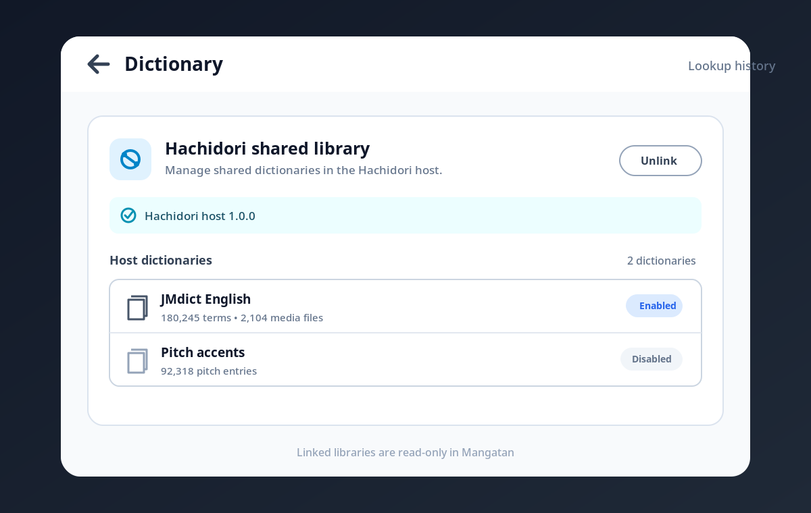

# Hachidori shared dictionary library

Mangatan can use the read-only dictionary library exposed by a Hachidori host.
The host remains authoritative: import, updates, ordering, enablement, and
removal stay in Hachidori. Unlinking immediately restores Mangatan's local
Yomitan dictionary controls without deleting local dictionaries.

## Link a library

1. In Hachidori, enable dictionary sharing through `hachidori-anki`.
2. Enable network sharing when Mangatan is running on another device.
3. Open Mangatan's Dictionary settings and enter the Hachidori host address.
4. Select **Test connection** and verify the host name, version, and dictionary
   count.
5. Select **Link library**. The host dictionaries appear in host order as a
   read-only list.
6. Use **Unlink** to return to Mangatan's local library.

## Manual verification checklist

- [ ] Start with at least one local Mangatan dictionary and confirm import,
      enable/disable, reorder, rename, update, and remove controls are visible.
- [ ] Probe an invalid address and confirm the failure is actionable and
      **Link library** remains disabled.
- [ ] Probe a real Hachidori host and confirm its name, version, and dictionary
      count before linking.
- [ ] Link and confirm every host dictionary appears in host order with the
      correct enabled or disabled status.
- [ ] Confirm all local mutation controls are absent while linked.
- [ ] Look up a term with plain and structured glossary content; verify
      frequencies, pitch data, dictionary CSS, and glossary media.
- [ ] Look up a Kanji entry and open a nested popup lookup.
- [ ] Change the host dictionary library and confirm Mangatan refreshes reads
      without mixing in local results.
- [ ] Disconnect and reconnect the host; confirm the UI reports state changes
      and resumes the same linked library.
- [ ] Unlink and confirm the original local dictionaries and mutation controls
      return unchanged.
- [ ] On iOS, accept Local Network access and test a release-signed physical
      device on the same LAN.
- [ ] On Android, verify release-build cleartext `ws://` reachability on the
      same LAN.
- [ ] On desktop, verify loopback and LAN addresses, then repeat after an app
      restart to confirm the link setting is restored.
